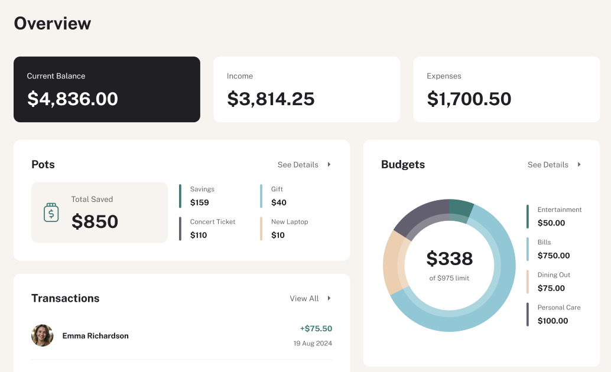

# Finance App

A personal finance dashboard for tracking budgets, savings pots, recurring bills, and transactions — all in one focused interface.



---

## Features

- **Overview Dashboard** — Current balance, income, and expenses at a glance with recent transactions
- **Budget Tracking** — Set spending limits per category and monitor usage in real time
- **Savings Pots** — Earmark money toward specific goals without opening extra accounts
- **Transactions** — Searchable, paginated transaction history with income/expense breakdown
- **Recurring Bills** — Track paid, upcoming, and due-soon bills in one table
- **Authentication** — Secure sign-up and sign-in via Clerk

---

## Tech Stack

| | Technology |
|---|---|
|  | **Next.js 16** — React framework with App Router |
|  | **React 19** — UI library |
|  | **TypeScript** — Static typing |
|  | **Tailwind CSS v4** — Utility-first styling |
|  | **shadcn/ui** — Accessible component primitives |
|  | **Hono** — Lightweight API router (served via Next.js route handlers) |
|  | **Clerk** — Authentication and user management |
|  | **Drizzle ORM** — Type-safe SQL query builder |
|  | **Turso (libSQL)** — Edge SQLite database |
|  | **TanStack Query** — Server state and data fetching |
|  | **TanStack Table** — Headless table primitives |
|  | **Recharts** — Composable chart library |
|  | **Zod** — Schema validation |
|  | **Biome** — Linting and formatting |

---

## Getting Started

### Prerequisites

- [Node.js](https://nodejs.org/) v20+
- [pnpm](https://pnpm.io/) v9+
- A [Clerk](https://clerk.com/) account
- A [Turso](https://turso.tech/) database

### 1. Clone the repository

```bash
git clone https://github.com/your-username/finance-app.git
cd finance-app
```

### 2. Install dependencies

```bash
pnpm install
```

### 3. Configure environment variables

Create a `.env` file in the project root:

```env
# Turso
TURSO_DATABASE_URL=libsql://your-database.turso.io
TURSO_AUTH_TOKEN=your-turso-auth-token

# Clerk
NEXT_PUBLIC_CLERK_PUBLISHABLE_KEY=pk_test_...
CLERK_SECRET_KEY=sk_test_...
NEXT_PUBLIC_CLERK_SIGN_IN_URL=/sign-in
NEXT_PUBLIC_CLERK_SIGN_UP_URL=/sign-up
NEXT_PUBLIC_CLERK_SIGN_IN_FORCE_REDIRECT_URL=/dashboard
NEXT_PUBLIC_CLERK_SIGN_UP_FORCE_REDIRECT_URL=/dashboard
```

### 4. Run database migrations

```bash
pnpm db:migrate
```

### 5. Start the development server

```bash
pnpm dev
```

Open [http://localhost:3000](http://localhost:3000) in your browser.

---

## Scripts

| Command | Description |
|---|---|
| `pnpm dev` | Start the development server |
| `pnpm build` | Build for production |
| `pnpm start` | Start the production server |
| `pnpm lint` | Run Biome linter |
| `pnpm lint:fix` | Auto-fix lint issues |
| `pnpm format` | Format source files with Biome |
| `pnpm db:generate` | Generate Drizzle migration files |
| `pnpm db:migrate` | Apply migrations to the database |
| `pnpm db:studio` | Open Drizzle Studio (database GUI) |
